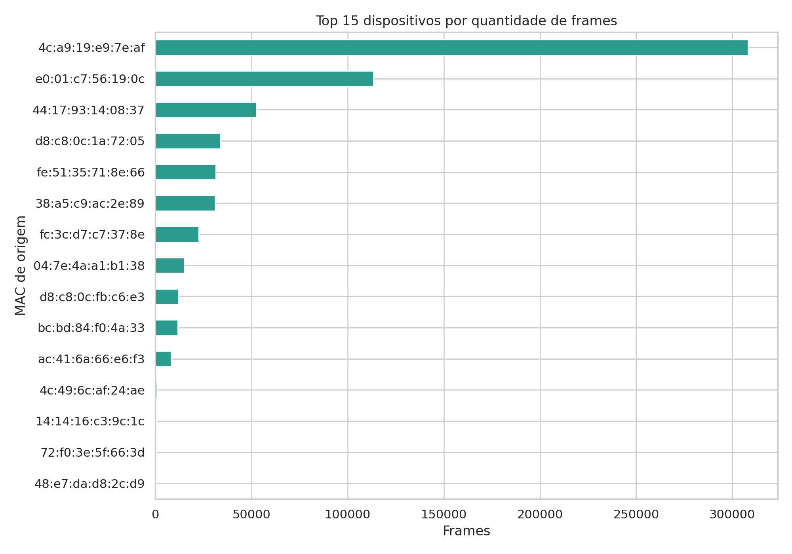
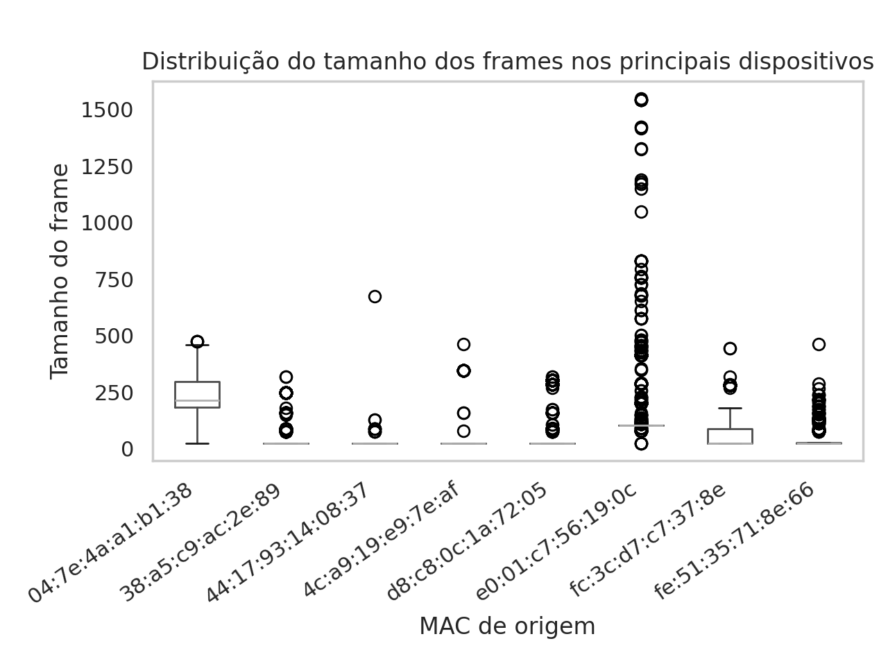
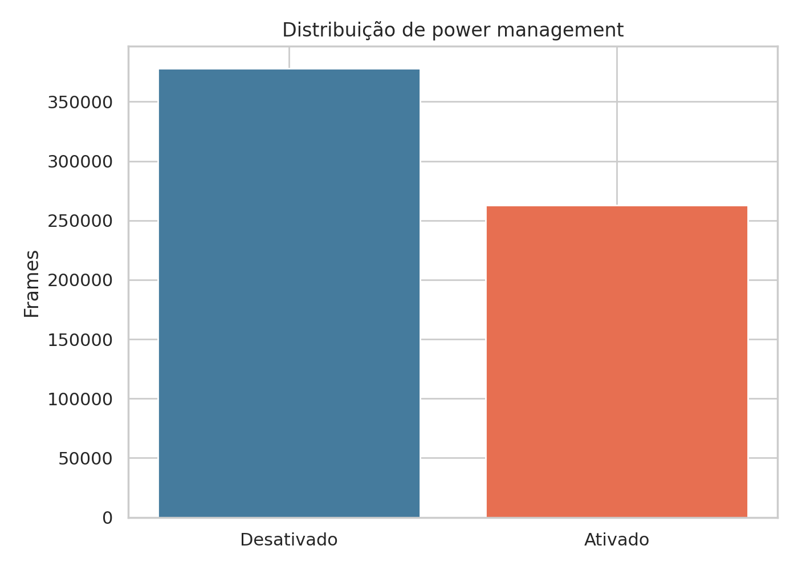
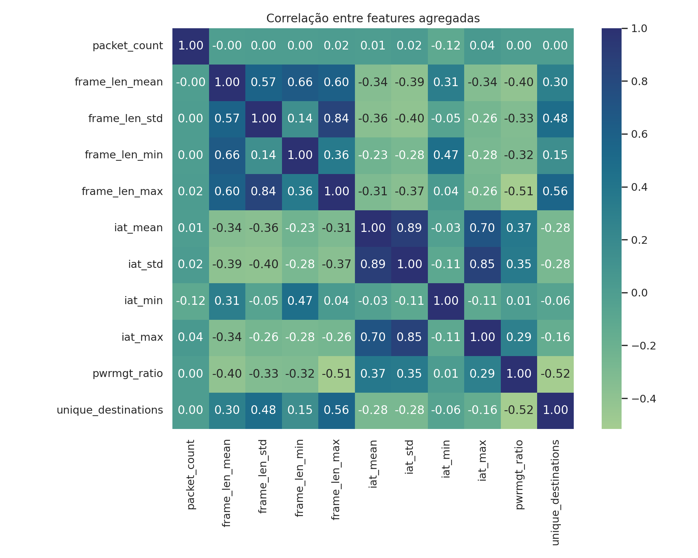
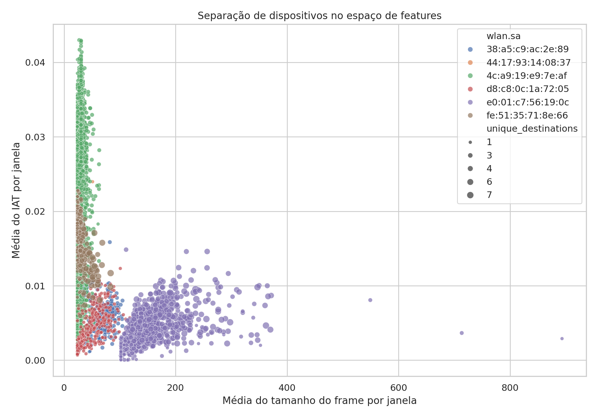
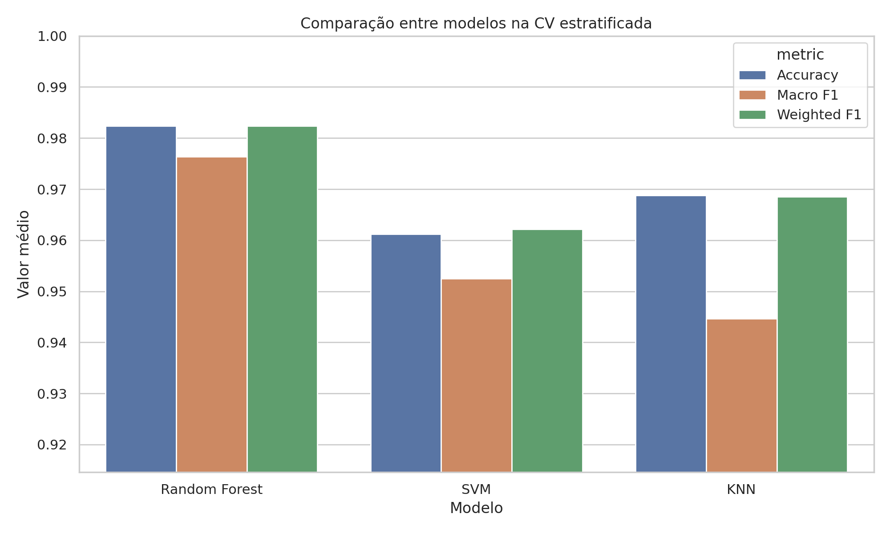
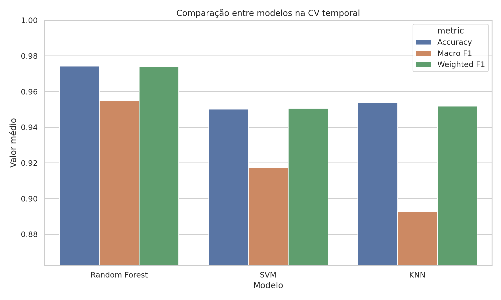
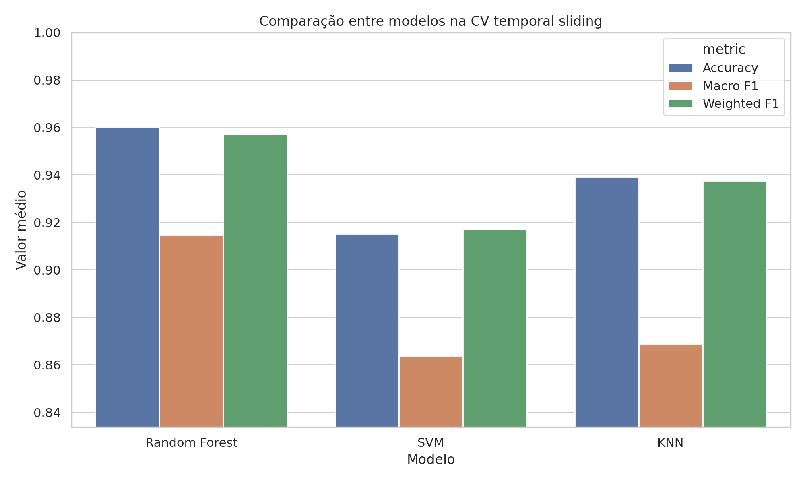
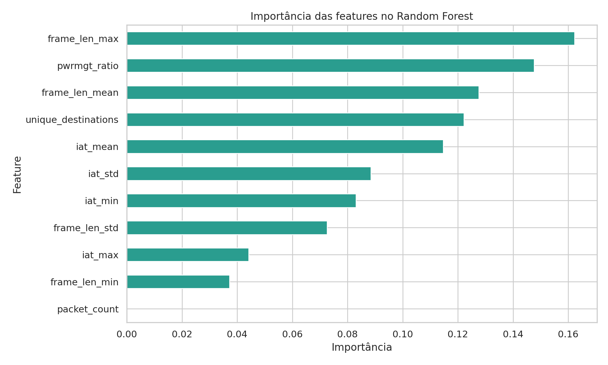

# Identificação de Dispositivos IoT por Fingerprint de Tráfego Wi-Fi

Pipeline de aprendizado de máquina supervisionado que identifica dispositivos IoT conectados a uma rede Wi-Fi com base em padrões comportamentais extraídos do tráfego capturado sem depender de inspeção profunda de pacotes, credenciais ou interação com os dispositivos. Esse trabalho faz parte da disciplina de Tópicos em Inteligência Computacional III do PGCOMP/UFBA.

---

## Sumário

1. [Contexto do Projeto](#1-contexto-do-projeto)
2. [Estrutura do Repositório](#2-estrutura-do-repositório)
3. [Como Executar](#3-como-executar)
4. [Metodologia](#4-metodologia)
5. [Análise Exploratória dos Dados](#5-análise-exploratória-dos-dados)
6. [Modelos Utilizados](#6-modelos-utilizados)
7. [Hiperparâmetros](#7-hiperparâmetros)
8. [Validação e Avaliação](#8-validação-e-avaliação)
9. [Análise dos Resultados](#9-análise-dos-resultados)
10. [Limitações](#10-limitações)
11. [Conclusão e Trabalhos Futuros](#11-conclusão-e-trabalhos-futuros)

---

## 1. Contexto do Projeto

### 1.1 Cenário

O crescimento acelerado de dispositivos IoT em ambientes domésticos e corporativos amplia significativamente a superfície de ataque das redes. Câmeras, roteadores, sensores e eletrodomésticos inteligentes frequentemente executam firmware desatualizado, não exibem interfaces de gerenciamento convencionais e se comunicam silenciosamente em segundo plano muitas vezes sem que os administradores de rede saibam exatamente quais equipamentos estão ativos.

### 1.2 Motivação

A identificação precisa dos dispositivos conectados é o primeiro passo para qualquer estratégia de segurança de rede: é impossível proteger o que não se conhece. Mecanismos tradicionais como inventário manual, varreduras de porta ou inspeção de banners de protocolo são impraticáveis em escala e ineficazes para dispositivos que não expõem serviços gerenciáveis.

Técnicas de **fingerprinting passivo de tráfego** surgem como alternativa: observar padrões de comunicação já presentes no tráfego de rede e usar esses padrões como assinaturas únicas de cada tipo de dispositivo.

### 1.3 Problema

Dado um conjunto de frames Wi-Fi capturados em uma rede, **identificar o dispositivo de origem de cada frame com base apenas nas características comportamentais do tráfego** como tamanho dos pacotes, cadência de transmissão e destinos acessados sem inspecionar o conteúdo dos pacotes.

### 1.4 Objetivos

**Objetivo geral:** identificar dispositivos IoT por fingerprinting passivo de tráfego Wi-Fi usando classificadores supervisionados.

**Objetivos específicos:**

- Organizar os dados brutos de captura em um pipeline reprodutível (bruto → tratado → features → modelos → relatórios).
- Extrair atributos comportamentais agregados por janelas de pacotes que representem a "assinatura" de cada dispositivo.
- Treinar e comparar classificadores supervisionados (Random Forest, KNN e SVM) sob as mesmas condições de dados e tuning.
- Avaliar o desempenho sob quatro protocolos de validação complementares, incluindo protocolos com preservação da ordem temporal.
- Documentar as limitações do escopo para sustentar academicamente os resultados obtidos.

---

## 2. Estrutura do Repositório

```
.
├── app/
│   └── streamlit_app.py        # Dashboard interativo (Streamlit)
├── data/
│   ├── 01 - Não-Tratados/      # Capturas brutas (.cap, .pcapng, .xlsx)
│   ├── 02 - Tratados/          # Dataset tratado pronto para modelagem (.csv)
│   └── 03 - Features/          # Reservado para features derivadas persistidas
├── models/                     # Modelos treinados serializados (.joblib)
├── notebooks/
│   └── 01_eda.ipynb            # Análise exploratória interativa (Jupyter)
├── reports/
│   ├── figures/                # Gráficos gerados (PNG)
│   ├── model_benchmark.csv     # Comparação entre os três modelos
│   ├── model_report.md         # Relatório consolidado (Random Forest)
│   ├── academic_report.md      # Relatório acadêmico do projeto
│   ├── rf/knn/svm_*            # Métricas e relatórios por modelo
│   └── *_best_params.json      # Hiperparâmetros selecionados por modelo
├── src/
│   ├── iot_fingerprint/
│   │   ├── config.py           # Caminhos centralizados do projeto
│   │   ├── data.py             # Carregamento e tratamento do dataset
│   │   ├── features.py         # Engenharia de features (janelas agregadas)
│   │   └── model_pipeline.py   # Pipeline completo: treino, CV, figuras, relatório
│   ├── model_specs.py          # Definição dos três modelos e seus espaços de busca
│   ├── train_all_models.py     # Entrypoint: treina os três modelos em sequência
│   ├── train_rf.py             # Entrypoint individual: Random Forest
│   ├── train_knn.py            # Entrypoint individual: KNN
│   └── train_svm.py            # Entrypoint individual: SVM
├── requirements.txt
└── README.md
```

---

## 3. Como Executar

### Pré-requisitos

- Python ≥ 3.12
- Dataset tratado em `data/02 - Tratados/processed_training2.csv`

### Instalação

```bash
python -m venv .venv
source .venv/bin/activate        # Linux/macOS
# .venv\Scripts\activate         # Windows

pip install -r requirements.txt
```

### Registrar o kernel Jupyter (necessário para o notebook)

```bash
python -m ipykernel install --user --name iot-fingerprint --display-name "Python (iot-fingerprint)"
```

### Executar os scripts

```bash
# Análise exploratória prévia
PYTHONPATH=src python src/analyze_datasets.py

# Gerar apenas as figuras de EDA (rápido, ~segundos)
PYTHONPATH=src python src/generate_eda_figures.py

# Treinar todos os modelos e gerar todos os artefatos
PYTHONPATH=src python src/train_all_models.py

# Treinar modelos individualmente
PYTHONPATH=src python src/train_rf.py
PYTHONPATH=src python src/train_knn.py
PYTHONPATH=src python src/train_svm.py
```

### Abrir o notebook de EDA

```bash
jupyter notebook notebooks/01_eda.ipynb
```

### Iniciar o dashboard Streamlit

```bash
streamlit run app/streamlit_app.py
```

---

## 4. Metodologia

### 4.1 Visão Geral do Pipeline


O pipeline parte da captura Wi-Fi bruta, realiza o tratamento dos dados, agrega os frames em janelas comportamentais por dispositivo, aplica estratégias de validação temporal e estratificada, ajusta hiperparâmetros via `RandomizedSearchCV` e exporta modelos, relatórios e figuras.

### 4.2 Origem dos Dados

Os dados foram obtidos por **captura passiva de tráfego Wi-Fi** em modo monitor, gerando arquivos `.cap` e `.pcapng` (disponíveis em `data/01 - Não-Tratados/`). Após extração e limpeza inicial, o dataset tratado foi consolidado em `data/02 - Tratados/processed_training2.csv`, com **642.163 frames brutos** e cinco colunas:

| Coluna                         | Tipo    | Descrição                              |
| ------------------------------ | ------- | ---------------------------------------- |
| `frame.time_delta_displayed` | float64 | Intervalo entre frames consecutivos (s)  |
| `wlan.sa`                    | string  | Endereço MAC de origem (variável-alvo) |
| `wlan.da`                    | string  | Endereço MAC de destino                 |
| `wlan.fc.pwrmgt`             | bool    | Sinalização de economy de energia      |
| `frame.len`                  | int64   | Tamanho do frame em bytes                |

### 4.3 Pré-processamento e Tratamento de Dados Ausentes

O carregamento e tratamento estão encapsulados em [`src/iot_fingerprint/data.py`](src/iot_fingerprint/data.py):

```python
def load_processed_training(path=PROCESSED_TRAINING_CSV) -> pd.DataFrame:
    df = pd.read_csv(path)

    df["frame.time_delta_displayed"] = pd.to_numeric(
        df["frame.time_delta_displayed"], errors="coerce"
    )
    df["frame.len"] = pd.to_numeric(df["frame.len"], errors="coerce")
    df["wlan.fc.pwrmgt"] = df["wlan.fc.pwrmgt"].astype(str).str.lower().map(
        {"true": 1, "false": 0}
    )

    return df.dropna()
```

**O que é feito e por quê:**

- **Coerção numérica** com `errors="coerce"`: valores não conversíveis (e.g., strings inválidas em `frame.time_delta_displayed`) são transformados em `NaN` em vez de levantar exceção, permitindo remoção controlada na etapa seguinte.
- **Normalização do `wlan.fc.pwrmgt`**: o campo booleano originalmente presente como `True`/`False` (string, case-insensitive) é mapeado para `{0, 1}` para uso direto como atributo numérico nos classificadores.
- **`dropna()`**: remove linhas com qualquer valor ausente. O impacto é mínimo **1.274 linhas removidas (0,20% do total)** concentradas na primeira linha de cada captura (sem delta de tempo) e em frames com MAC não resolvido.

### 4.4 Engenharia de Features Agregação em Janelas

Classificar pacotes individuais seria ruidoso e ineficiente: um único frame pequeno de controle não distingue dispositivos. A solução adotada em [`src/iot_fingerprint/features.py`](src/iot_fingerprint/features.py) é **agregar o tráfego em janelas fixas de 100 pacotes por dispositivo** e calcular estatísticas descritivas de cada janela:

```python
def build_device_windows(
    df: pd.DataFrame,
    device_col: str = "wlan.sa",
    window_size: int = 100,
) -> pd.DataFrame:
    work = df.copy()
    work["_window"] = work.groupby(device_col).cumcount() // window_size

    features = (
        work.groupby([device_col, "_window"])
        .agg(
            packet_count      = ("frame.len", "size"),
            frame_len_mean    = ("frame.len", "mean"),
            frame_len_std     = ("frame.len", "std"),
            frame_len_min     = ("frame.len", "min"),
            frame_len_max     = ("frame.len", "max"),
            iat_mean          = ("frame.time_delta_displayed", "mean"),
            iat_std           = ("frame.time_delta_displayed", "std"),
            iat_min           = ("frame.time_delta_displayed", "min"),
            iat_max           = ("frame.time_delta_displayed", "max"),
            pwrmgt_ratio      = ("wlan.fc.pwrmgt", "mean"),
            unique_destinations = ("wlan.da", "nunique"),
        )
        .reset_index()
    )

    return features.fillna(0)
```

**Por que janelas de 100 pacotes:**

| Tamanho       | Total de janelas                     | Dispositivos com ≥ 10 janelas | Mínimo de janelas por dispositivo |
| ------------- | ------------------------------------ | ------------------------------ | ---------------------------------- |
| 25            | 25.644                               | 14                             | 8                                  |
| **100** | **6.418** (6.399 após filtro) | **11**                   | **2**                        |
| 200           | 3.213                                | 11                             | 1                                  |
| 500           | 1.288                                | 11                             | 1                                  |

Janelas menores (25 pacotes) geram mais amostras, mas excluem dispositivos menos ativos do filtro mínimo (`MIN_WINDOWS_PER_DEVICE = 10`), reduzindo a cobertura de classes. Janelas maiores (≥ 200) preservam todas as classes, mas com poucas janelas por dispositivo, comprometendo a validação cruzada e o holdout temporal. O valor **100** representa um equilíbrio entre estabilidade estatística e volume de amostras.

**Os 11 atributos gerados** cobrem:

- Perfil de tamanho de frame: `frame_len_{mean,std,min,max}`
- Cadência de transmissão: `iat_{mean,std,min,max}`
- Comportamento energético: `pwrmgt_ratio`
- Diversidade de destinos: `unique_destinations`

### 4.5 Normalização e Padronização

O Random Forest é invariante à escala dos atributos e, portanto, recebe os dados sem transformação adicional. Para **KNN e SVM**, que dependem de distâncias euclidianas ou margens no espaço de features, a padronização é essencial. Ambos são encapsulados em `Pipeline` do scikit-learn com `StandardScaler` como primeira etapa, garantindo que a normalização ocorra **dentro de cada fold de CV** e nunca vaze informação do conjunto de teste para o de treino:

```python
# Em src/model_specs.py
KNN_SPEC = ModelSpec(
    estimator_factory=lambda: Pipeline([
        ("scaler", StandardScaler()),
        ("model", KNeighborsClassifier(n_neighbors=5, weights="distance")),
    ]),
    ...
)

SVM_SPEC = ModelSpec(
    estimator_factory=lambda: Pipeline([
        ("scaler", StandardScaler()),
        ("model", SVC(kernel="rbf", C=3.0, gamma="scale", class_weight="balanced")),
    ]),
    ...
)
```

### 4.6 Divisão Treino/Teste

A divisão responde à **ordem temporal** dos dados por dispositivo, evitando o vazamento de informação que ocorreria em um `train_test_split` aleatório (onde janelas futuras poderiam treinar sobre padrões de janelas passadas do mesmo dispositivo):

```python
def temporal_device_split(features, test_fraction=0.2):
    for _, device_rows in features.groupby("wlan.sa", sort=False):
        ordered_rows = device_rows.sort_values("_window").reset_index(drop=True)
        split_idx = max(1, int(len(ordered_rows) * (1 - test_fraction)))
        split_idx = min(split_idx, len(ordered_rows) - 1)
        train_parts.append(ordered_rows.iloc[:split_idx])   # primeiros 80%
        test_parts.append(ordered_rows.iloc[split_idx:])    # últimos 20%
```

**Para cada dispositivo individualmente**, as primeiras 80% das janelas (ordem cronológica) vão para treino e as últimas 20% vão para teste. Isso simula o cenário real: o modelo aprende com o histórico passado e é avaliado em tráfego futuro.

---

## 5. Análise Exploratória dos Dados

A EDA completa está disponível em [`notebooks/01_eda.ipynb`](notebooks/01_eda.ipynb) (executado com outputs). As principais análises realizadas e seus impactos nas decisões do projeto são descritos abaixo.

### 5.1 Qualidade dos Dados

Antes de qualquer tratamento, o CSV bruto possui **642.163 linhas** com **1.274 valores ausentes** distribuídos em três colunas. Após o `dropna()`, restam **640.889 frames**, uma perda de apenas **0,20%**, confirmando que o tratamento atual não introduz viés relevante.

### 5.2 Desbalanceamento entre Dispositivos

O dataset tratado contém **15 dispositivos** identificados inicialmente. Após o filtro `MIN_WINDOWS_PER_DEVICE = 10`, quatro dispositivos com menos de 10 janelas agregadas são excluídos, e o conjunto final de modelagem passa a cobrir **11 dispositivos** com distribuição extremamente assimétrica:

| Métrica                   | Valor              |
| -------------------------- | ------------------ |
| Dispositivo mais ativo     | 308.228 frames     |
| Dispositivo menos ativo    | 196 frames         |
| Razão de desbalanceamento | **~1.573×** |



**Impacto nas decisões:** esta razão de ~1.573× justifica três escolhas no pipeline:

1. Uso de **Macro F1** (em vez de accuracy simples) como critério de tuning e comparação dá peso igual a todas as classes independentemente do tamanho.
2. `class_weight="balanced"` no Random Forest e no SVM compensa o desbalanceamento durante o treino reescalando as perdas.
3. Filtro `MIN_WINDOWS_PER_DEVICE = 10` remove 4 dispositivos com menos de 10 janelas, cujas classes teriam amostras insuficientes para qualquer avaliação robusta.

### 5.3 Tamanho de Frame por Dispositivo

A distribuição geral de `frame.len` é fortemente assimétrica: mediana de 24 bytes (frames de controle/gerenciamento), com cauda longa até 1.550 bytes (frames de dados). Por dispositivo, as medianas e dispersões variam visivelmente, o que sustenta o uso de quatro estatísticas (`mean`, `std`, `min`, `max`) em vez de um único valor representativo.



### 5.4 Intervalo Entre Pacotes (IAT)

O intervalo entre frames consecutivos (`frame.time_delta_displayed`) varia entre 3 µs e 252 ms. Por dispositivo, alguns apresentam cadência regular (caixa estreita no boxplot), indicando padrões periódicos típicos de sensores, enquanto outros exibem tráfego em rajada. Essa diferença comportamental é capturada pelo conjunto `iat_{mean,std,min,max}`.

### 5.5 Power Management e Destinos Únicos

O `pwrmgt_ratio` (proporção de frames com sinalização de economia de energia ativa) varia de **quase 0 a quase 1** entre dispositivos, tornando-o um atributo discriminativo forte.



O número de destinos únicos por janela (`unique_destinations`) também varia, mas com ressalva: o dataset captura apenas **38 endereços MAC de destino distintos** em toda a base, sugerindo topologia limitada (poucos APs/gateways). Esse atributo pode refletir a infraestrutura de captura específica tanto quanto o comportamento do dispositivo.

### 5.6 Correlação entre Atributos

As três variáveis numéricas brutas `frame.len`, `frame.time_delta_displayed` e `wlan.fc.pwrmgt` apresentam correlação fraca entre si (|r| < 0,15), confirmando que cada uma contribui com informação distinta e nenhuma é candidata óbvia de descarte por redundância.



### 5.7 Separabilidade no Espaço de Features

Após a agregação em janelas, uma projeção PCA de 2 componentes (que captura a maior parte da variância) revela que os dispositivos formam **aglomerados visualmente distintos** no espaço de features. Esse resultado pré-valida que a estrutura dos dados suporta a abordagem de classificação supervisionada.



---

## 6. Modelos Utilizados

Os três classificadores foram definidos em [`src/model_specs.py`](src/model_specs.py) e avaliados sob condições idênticas de dados, tuning e validação.

### 6.1 Random Forest

**Funcionamento:** constrói um ensemble de árvores de decisão treinadas em subconjuntos aleatórios de amostras e features (bagging + feature randomness). A predição final é a votação da maioria das árvores.

**Por que foi escolhido:** é o modelo principal do projeto por três razões:

1. Captura relações não-lineares entre os atributos de fingerprint sem exigir transformações manuais.
2. Fornece `feature_importances_`, permitindo interpretar quais atributos mais discriminam os dispositivos.
3. É robusto a features em escalas diferentes não exige `StandardScaler`.

**Vantagens:** alta performance em dados tabulares, interpretável via importância de features, suporta `class_weight="balanced"` nativamente.

**Limitações:** pode overfitar em datasets pequenos com alta dimensionalidade; modelos mais profundos têm custo de predição maior.

```python
RF_SPEC = ModelSpec(
    name="Random Forest",
    slug="rf",
    estimator_factory=lambda: RandomForestClassifier(
        n_estimators=300,
        random_state=42,
        class_weight="balanced",
        n_jobs=-1,
    ),
    supports_feature_importance=True,
    param_distributions={
        "n_estimators": [200, 300, 500],
        "max_depth": [None, 10, 20, 30],
        "min_samples_split": [2, 5, 10],
        "min_samples_leaf": [1, 2, 4],
        "max_features": ["sqrt", "log2", None],
    },
    tuning_iterations=10,
)
```

### 6.2 KNN (K-Nearest Neighbors)

**Funcionamento:** classifica uma amostra pela maioria dos `k` vizinhos mais próximos no espaço de features, usando distância euclidiana (ou de Manhattan).

**Por que foi escolhido:** serve como **baseline de proximidade**, verificando se as fingerprints agregadas formam aglomerados compactos no espaço de features. Se até o KNN classifica bem, os dados têm estrutura local forte.

**Vantagens:** intuitivo, sem hipóteses sobre distribuições dos dados, sensível à estrutura local dos aglomerados.

**Limitações:** custo de predição cresce com o tamanho do dataset (`O(n)`); degrada sob validação temporal sliding, que reduz o conjunto de treino a uma janela fixa recente.

```python
KNN_SPEC = ModelSpec(
    name="KNN",
    slug="knn",
    estimator_factory=lambda: Pipeline([
        ("scaler", StandardScaler()),
        ("model", KNeighborsClassifier(n_neighbors=5, weights="distance")),
    ]),
    param_distributions={
        "model__n_neighbors": [3, 5, 7, 9, 11, 15],
        "model__weights": ["uniform", "distance"],
        "model__p": [1, 2],
    },
    tuning_iterations=8,
)
```

### 6.3 SVM com Kernel RBF

**Funcionamento:** projeta os dados em um espaço de alta dimensão via função kernel (RBF, neste caso) e encontra um hiperplano de margem máxima que separa as classes. Para múltiplas classes, usa estratégia one-vs-one.

**Por que foi escolhido:** verifica se fronteiras de decisão não-lineares no espaço de features capturadas pela função RBF melhoram a separação além do que o KNN consegue por proximidade local.

**Vantagens:** eficaz em espaços de alta dimensão; a margem máxima favorece generalização.

**Limitações:** custo de treino cúbico no número de amostras (mitigado aqui pelo dataset moderado após agregação); menos interpretável que RF.

```python
SVM_SPEC = ModelSpec(
    name="SVM",
    slug="svm",
    estimator_factory=lambda: Pipeline([
        ("scaler", StandardScaler()),
        ("model", SVC(kernel="rbf", C=3.0, gamma="scale", class_weight="balanced")),
    ]),
    param_distributions={
        "model__C": [0.5, 1.0, 3.0, 10.0],
        "model__gamma": ["scale", "auto", 0.01, 0.1],
        "model__kernel": ["rbf", "poly"],
    },
    tuning_iterations=8,
)
```

---

## 7. Hiperparâmetros

### 7.1 Estratégia de Tuning

Todos os modelos passaram por **`RandomizedSearchCV`** com `scoring="f1_macro"` e validação cruzada interna de 5 folds estratificados (`StratifiedKFold(n_splits=5, shuffle=True, random_state=42)`). A lógica está em [`src/iot_fingerprint/model_pipeline.py`](src/iot_fingerprint/model_pipeline.py):

```python
def tune_estimator(model_spec, x_train, y_train):
    splitter = StratifiedKFold(n_splits=5, shuffle=True, random_state=42)
    search = RandomizedSearchCV(
        estimator=model_spec.estimator_factory(),
        param_distributions=model_spec.param_distributions,
        n_iter=model_spec.tuning_iterations,
        scoring="f1_macro",
        cv=splitter,
        random_state=42,
        n_jobs=-1,
        refit=True,
    )
    search.fit(x_train, y_train)
    return search.best_estimator_, search.best_params_, float(search.best_score_)
```

**Por que `RandomizedSearchCV` e não `GridSearchCV`:** a busca aleatória explora o espaço de hiperparâmetros de forma mais eficiente com número de iterações fixo. O espaço combinatório do Random Forest, por exemplo, possui 3 × 4 × 3 × 3 × 3 = 324 combinações possíveis; com `n_iter=10` exploram-se 10 combinações aleatórias com custo controlado.

**Por que `f1_macro` como critério:** com 11 classes e desbalanceamento de até ~1.573×, a accuracy pode ser enganosa. O Macro F1 pondera cada classe igualmente, independentemente do número de amostras, penalizando modelos que ignoram classes minoritárias.

Os resultados completos de cada combinação testada estão salvos em `reports/rf_tuning_cv_results.csv`, `reports/knn_tuning_cv_results.csv` e `reports/svm_tuning_cv_results.csv`.

### 7.2 Resultados da Busca de Hiperparâmetros

#### Random Forest (10 combinações testadas)

> Melhor Macro F1 médio na busca (5-fold CV no treino): **0,9784**

| #           | `n_estimators` | `max_depth` | `min_samples_split` | `min_samples_leaf` | `max_features` | Macro F1 médio  | Desvio padrão   |
| ----------- | ---------------- | ------------- | --------------------- | -------------------- | ---------------- | ---------------- | ---------------- |
| **1** | **200**    | **10**  | **2**           | **1**          | **log2**   | **0,9784** | **0,0077** |
| 2           | 300              | 20            | 10                    | 1                    | log2             | 0,9778           | 0,0062           |
| 3           | 200              | sem limite    | 2                     | 2                    | sqrt             | 0,9761           | 0,0079           |
| 4           | 500              | 30            | 5                     | 4                    | sqrt             | 0,9742           | 0,0093           |
| 5           | 200              | 20            | 2                     | 4                    | sqrt             | 0,9733           | 0,0097           |
| 6           | 200              | 10            | 2                     | 4                    | log2             | 0,9722           | 0,0113           |
| 7           | 200              | 10            | 10                    | 4                    | log2             | 0,9707           | 0,0104           |
| 8           | 500              | 10            | 2                     | 1                    | sem limite       | 0,9669           | 0,0051           |
| 9           | 200              | 20            | 5                     | 1                    | sem limite       | 0,9648           | 0,0038           |
| 10          | 200              | 10            | 2                     | 2                    | sem limite       | 0,9643           | 0,0057           |

**Observações:**

- `max_features="log2"` supera `"sqrt"` e `None` (todas as features): restringir o número de features por split aumenta a diversidade entre árvores e reduz a correlação do ensemble.
- `max_depth=10` equilibra capacidade e regularização: árvores sem limite de profundidade (`None`) na terceira posição já mostram desempenho inferior, indicando tendência ao overfitting.
- `n_estimators=200` é suficiente: 300 e 500 árvores não superam 200 no melhor resultado, confirmando retorno decrescente acima desse valor para este dataset.
- `min_samples_leaf=1` e `min_samples_split=2` (restrições mínimas) acompanham o melhor resultado pois, combinados com `max_depth=10`, a profundidade já controla o overfitting.

#### KNN (8 combinações testadas)

> Melhor Macro F1 médio na busca (5-fold CV no treino): **0,9450**

| #           | `weights`        | `p` (distância)      | `n_neighbors` | Macro F1 médio  | Desvio padrão   |
| ----------- | ------------------ | ----------------------- | --------------- | ---------------- | ---------------- |
| **1** | **distance** | **1 (Manhattan)** | **7**     | **0,9450** | **0,0149** |
| 2           | distance           | 1 (Manhattan)           | 3               | 0,9436           | 0,0115           |
| 3           | distance           | 1 (Manhattan)           | 9               | 0,9418           | 0,0161           |
| 4           | uniform            | 1 (Manhattan)           | 7               | 0,9415           | 0,0148           |
| 5           | uniform            | 1 (Manhattan)           | 3               | 0,9398           | 0,0132           |
| 6           | uniform            | 1 (Manhattan)           | 11              | 0,9379           | 0,0164           |
| 7           | distance           | 2 (Euclidiana)          | 7               | 0,9224           | 0,0157           |
| 8           | uniform            | 2 (Euclidiana)          | 11              | 0,9122           | 0,0152           |

**Observações:**

- **`p=1` (distância de Manhattan) é decisivo:** todas as 6 melhores combinações usam Manhattan; as 2 piores usam distância euclidiana (`p=2`). No espaço de features de fingerprint, onde `frame_len_mean` e `iat_mean` podem ter escalas e distribuições muito diferentes, Manhattan é menos sensível a outliers em dimensões individuais.
- **`weights="distance"` supera `"uniform"` consistentemente:** o gradiente de peso pelos vizinhos mais próximos melhora a separação nas fronteiras de classe, especialmente relevante dado que dispositivos diferentes formam clusters de tamanhos desiguais.
- **`k=7` é o ponto ótimo:** k=3 tem variância maior (std maior); k=9 e k=11 introduzem vizinhos de classes diferentes nas regiões de fronteira.

#### SVM (8 combinações testadas)

> Melhor Macro F1 médio na busca (5-fold CV no treino): **0,9550**

| #           | `kernel`    | `gamma`       | `C`          | Macro F1 médio  | Desvio padrão   |
| ----------- | ------------- | --------------- | -------------- | ---------------- | ---------------- |
| **1** | **rbf** | **scale** | **10,0** | **0,9550** | **0,0086** |
| 1           | rbf           | 0,1             | 10,0           | 0,9550           | 0,0086           |
| 3           | rbf           | scale           | 1,0            | 0,9043           | 0,0145           |
| 4           | poly          | scale           | 10,0           | 0,8854           | 0,0087           |
| 5           | poly          | scale           | 3,0            | 0,8519           | 0,0130           |
| 6           | poly          | 0,1             | 1,0            | 0,8337           | 0,0128           |
| 6           | poly          | scale           | 1,0            | 0,8337           | 0,0128           |
| 8           | poly          | 0,01            | 10,0           | 0,3775           | 0,0164           |

**Observações:**

- **Kernel RBF supera poly amplamente:** a maior diferença é de ~6 pontos percentuais entre o melhor `poly` (0,8854) e o melhor `rbf` (0,9550). O espaço de features de fingerprint não apresenta a estrutura polinomial que o kernel `poly` pressupõe.
- **`C=10` é significativamente melhor que `C=1`:** a diferença de 0,9550 para 0,9043 com `rbf` mostra que uma margem mais rígida (maior penalidade por violações) beneficia este dataset, onde os clusters de dispositivos são bem separados mas com alguma sobreposição nas bordas.
- **Empate entre `gamma="scale"` e `gamma=0,1`** no rank 1: `"scale"` equivale a `1 / (n_features × var(X))` e, para estas features normalizadas, produz valor próximo a 0,1. O scikit-learn selecionou `gamma="scale"` como o melhor parâmetro por ter aparecido primeiro na busca.
- **`gamma=0,01` com poly colapsa para 0,3775:** kernel polinomial com gamma muito pequeno gera uma superfície de decisão quase linear, insuficiente para separar 11 dispositivos.

### 7.3 Resumo dos Melhores Hiperparâmetros

| Modelo        | Parâmetro            | Valor selecionado | Macro F1 da busca |
| ------------- | --------------------- | ----------------- | ----------------- |
| Random Forest | `n_estimators`      | 200               | **0,9784**  |
| Random Forest | `max_depth`         | 10                |                   |
| Random Forest | `min_samples_split` | 2                 |                   |
| Random Forest | `min_samples_leaf`  | 1                 |                   |
| Random Forest | `max_features`      | `"log2"`        |                   |
| KNN           | `n_neighbors`       | 7                 | **0,9450**  |
| KNN           | `weights`           | `"distance"`    |                   |
| KNN           | `p`                 | 1 (Manhattan)     |                   |
| SVM           | `kernel`            | `"rbf"`         | **0,9550**  |
| SVM           | `C`                 | 10,0              |                   |
| SVM           | `gamma`             | `"scale"`       |                   |

Os arquivos com os parâmetros completos estão em `reports/rf_best_params.json`, `reports/knn_best_params.json` e `reports/svm_best_params.json`. Os resultados de todas as combinações testadas estão em `reports/rf_tuning_cv_results.csv`, `reports/knn_tuning_cv_results.csv` e `reports/svm_tuning_cv_results.csv`.

---

## 8. Validação e Avaliação

### 8.1 Estratégias de Validação

A avaliação combina **quatro protocolos complementares**, ordenados do menos ao mais rigoroso em relação à ordem temporal:

#### Holdout Temporal por Dispositivo

Para cada dispositivo, as janelas são ordenadas cronologicamente e divididas em 80% treino / 20% teste. O modelo vê apenas o passado de cada dispositivo e é avaliado em seu tráfego futuro.

#### Validação Cruzada Estratificada (5-Fold)

As 6.399 janelas são divididas em 5 folds preservando a proporção de cada dispositivo. **Não impõe restrição temporal**; serve como referência comparativa de desempenho máximo possível. O código está em `stratified_cv()` em `model_pipeline.py`.

#### Validação Cruzada Temporal Expanding

Para cada dispositivo, as janelas são divididas em blocos temporais. O treino de cada fold usa todo o histórico acumulado até aquele ponto; o teste usa o bloco imediatamente seguinte. A cada fold, o conjunto de treino cresce:

```python
def temporal_cv_splits(features, n_splits=5):
    for fold in range(1, n_splits + 1):
        for _, device_rows in features.groupby("wlan.sa", sort=False):
            ordered_indices = device_rows.sort_values("_window").index.to_numpy()
            boundaries = np.linspace(0, len(ordered_indices), n_splits + 2, dtype=int)
            train_end = boundaries[fold]
            test_end  = boundaries[fold + 1]
            train_indices.extend(ordered_indices[:train_end])
            test_indices.extend(ordered_indices[train_end:test_end])
```

#### Validação Cruzada Temporal Sliding

Similar ao expanding, mas **o treino é restrito a uma janela fixa recente** o histórico mais antigo é descartado a cada fold. É o protocolo mais rigoroso, pois simula um modelo com memória limitada:

```python
def sliding_temporal_cv_splits(features, n_splits=5):
    for fold in range(n_splits):
        for _, device_rows in features.groupby("wlan.sa", sort=False):
            ordered_indices = device_rows.sort_values("_window").index.to_numpy()
            boundaries = np.linspace(0, len(ordered_indices), n_splits + 2, dtype=int)
            train_start = boundaries[fold]
            train_end   = boundaries[fold + 1]
            test_end    = boundaries[fold + 2]
            train_indices.extend(ordered_indices[train_start:train_end])  # janela fixa
            test_indices.extend(ordered_indices[train_end:test_end])
```

**Prevenção de vazamento de dados:** em todos os protocolos temporais, a normalização (`StandardScaler`) está encapsulada no `Pipeline` do scikit-learn e é ajustada **apenas nos dados de treino de cada fold**, sem jamais ver os dados de teste antes da predição.

### 8.2 Métricas

| Métrica    | Fórmula (simplificada)                            | Uso neste projeto                                                             |
| ----------- | -------------------------------------------------- | ----------------------------------------------------------------------------- |
| Accuracy    | (predições corretas) / (total)                   | Referência geral, interpretada com cautela dado o desbalanceamento           |
| Macro F1    | média não-ponderada do F1 de cada classe         | **Critério principal** de tuning e comparação pondera classes iguais |
| Weighted F1 | média do F1 ponderada pelo suporte de cada classe | Referência complementar próxima à accuracy ponderada                       |

O Macro F1 é a métrica prioritária porque, com 11 classes e razão de desbalanceamento de ~1.573×, uma accuracy alta pode ser obtida simplesmente acertando as classes majoritárias e errando sistematicamente as menores.

---

## 9. Análise dos Resultados

### 9.1 Comparação Entre Modelos

| Modelo                  | HoldoutMacro F1  | CV Estrat.Macro F1 | CV TemporalMacro F1 | CV SlidingMacro F1 | TuningMacro F1   |
| ----------------------- | ---------------- | ------------------ | ------------------- | ------------------ | ---------------- |
| **Random Forest** | **0,9527** | **0,9764**   | **0,9548**    | **0,9147**   | **0,9784** |
| SVM                     | 0,9334           | 0,9525             | 0,9174              | 0,8638             | 0,9550           |
| KNN                     | 0,9444           | 0,9446             | 0,8927              | 0,8688             | 0,9450           |





### 9.2 Interpretação

**Random Forest é o melhor modelo em todos os protocolos.** A vantagem sobre SVM e KNN é consistente e cresce nos protocolos mais restritivos. A importância de features revela que `frame_len_mean` e `iat_mean` são os atributos mais discriminativos coerente com a análise exploratória, que mostrou diferenças claras por dispositivo nessas dimensões.



**A degradação de desempenho do holdout para o sliding não é um problema; ela é esperada e metodologicamente informativa.** O protocolo sliding restringe o histórico de treino a uma janela recente fixa, simulando um cenário de adaptação contínua com memória limitada. O Random Forest cai de Macro F1 = 0,9764 (CV estratificada) para 0,9147 (CV sliding), uma diferença de ~6 pontos percentuais que demonstra a sensibilidade do modelo à quantidade de histórico disponível.

**O KNN degrada mais sob restrições temporais** do que o RF ou SVM. Isso é esperado: com menos janelas de treino por fold no protocolo sliding, os vizinhos mais próximos passam a representar um histórico menor e menos representativo da variabilidade de cada dispositivo.

**A queda do SVM entre CV estratificada e CV temporal** (0,9525 → 0,9174 em Macro F1) é proporcionalmente maior que a do RF (0,9764 → 0,9548), sugerindo que o SVM é mais sensível à distribuição temporal dos dados a fronteira de margem máxima aprendida em dados misturados (CV estratificada) generaliza menos bem para janelas temporalmente posteriores.

### 9.3 Matrizes de Confusão

As matrizes de confusão por modelo estão em:

- `reports/figures/rf_confusion_matrix.png`
- `reports/figures/knn_confusion_matrix.png`
- `reports/figures/svm_confusion_matrix.png`

Os erros de classificação mais frequentes ocorrem entre dispositivos com poucos frames (classes com menos janelas após a agregação), coerente com o desbalanceamento documentado na EDA.

---

## 10. Limitações

| Limitação                                   | Descrição                                                                                                                                                                     | Impacto                                                                         |
| --------------------------------------------- | ------------------------------------------------------------------------------------------------------------------------------------------------------------------------------- | ------------------------------------------------------------------------------- |
| **Escopo do alvo**                      | O modelo classifica dispositivos**observados no conjunto analisado** (11 MACs de origem). Não generaliza para dispositivos nunca vistos.                                 | Não pode ser usado diretamente como detector universal de tipo de dispositivo. |
| **Dependência do ambiente de captura** | Com apenas 38 destinos distintos em todo o dataset, o atributo`unique_destinations` pode refletir a topologia da rede de captura tanto quanto o comportamento do dispositivo. | Risco de baixa transferabilidade para redes com infraestrutura diferente.       |
| **Desbalanceamento residual**           | Mesmo com Macro F1 e`class_weight="balanced"`, classes com poucas janelas têm menor precisão nas matrizes de confusão.                                                     | Erros concentrados nos dispositivos menos ativos.                               |
| **Granularidade fixa de janela**        | A janela de 100 pacotes é uma escolha de projeto. Outra granularidade altera o equilíbrio entre estabilidade estatística e sensibilidade a mudanças de comportamento.       | Resultados específicos a essa configuração.                                  |
| **Dataset único**                      | Uma única sessão de captura em um único ambiente. Variações de dia, horário, topologia ou conjunto de dispositivos não foram avaliadas.                                  | Generalização para outros ambientes deve ser tratada com cautela.             |
| **Ausência de dispositivos novos**     | A validação temporal melhora o rigor, mas não equivale a avaliar o modelo contra MACs nunca vistos no treino.                                                                | O cenário de "dispositivo desconhecido" não foi abordado.                     |

---

## 11. Conclusão e Trabalhos Futuros

### 11.1 Conclusão

O projeto demonstrou que é possível identificar dispositivos IoT por fingerprint passivo de tráfego Wi-Fi com desempenho elevado, desde que os dados sejam devidamente tratados e agregados em janelas estatísticas. O pipeline construído de ponta a ponta, do CSV bruto aos artefatos de modelo, é reprodutível, documentado e sustentado por escolhas metodológicas explicitadas ao longo do projeto.

O Random Forest foi o classificador com melhor desempenho em todos os quatro protocolos de validação, atingindo Macro F1 de **0,9527 no holdout temporal**, **0,9764 na CV estratificada** e **0,9147 na CV temporal sliding** o protocolo mais rigoroso. A superioridade consistente do RF sobre KNN e SVM foi confirmada empiricamente, não arbitrariamente.

A principal contribuição metodológica é a combinação de quatro protocolos de validação com diferentes graus de rigor temporal, que permite defender o resultado tanto em um cenário favorável (CV estratificada) quanto em um cenário restritivo (CV sliding), documentando de forma honesta a degradação esperada.

### 11.2 Trabalhos Futuros

- **Generalização cross-ambiente:** avaliar modelos treinados em uma captura e testados em outra, com diferentes redes, horários e topologias.
- **Detecção de dispositivos novos (open-set recognition):** estender o pipeline para sinalizar quando um frame provavelmente pertence a um dispositivo não visto no treino, em vez de forçar a classificação em uma classe conhecida.
- **Features temporais dinâmicas:** explorar janelas deslizantes com sobreposição ou features baseadas em séries temporais (e.g., autocorrelação do IAT) para capturar comportamentos periódicos.
- **Adaptação contínua:** dado que a performance cai no protocolo sliding (memória limitada), investigar estratégias de retreino online ou ensemble incremental para manter o desempenho ao longo do tempo.
- **Múltiplas capturas:** ampliar o dataset com mais sessões de captura de diferentes dispositivos IoT comerciais para melhorar a representatividade e a generalização.
- **Integração com o pipeline de segurança:** conectar a saída do classificador a sistemas de inventário de rede ou SIEM para uso em produção, o que está fora do escopo atual (identificação apenas, sem regras de segurança ou detecção de anomalias).

